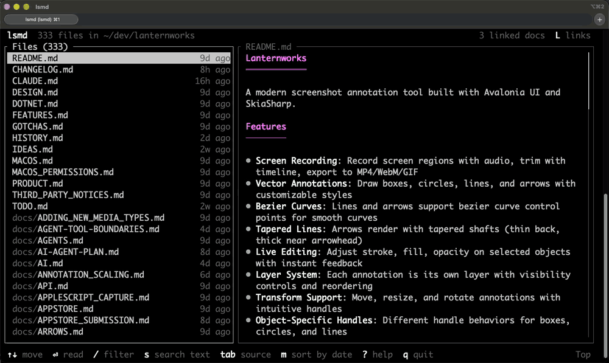
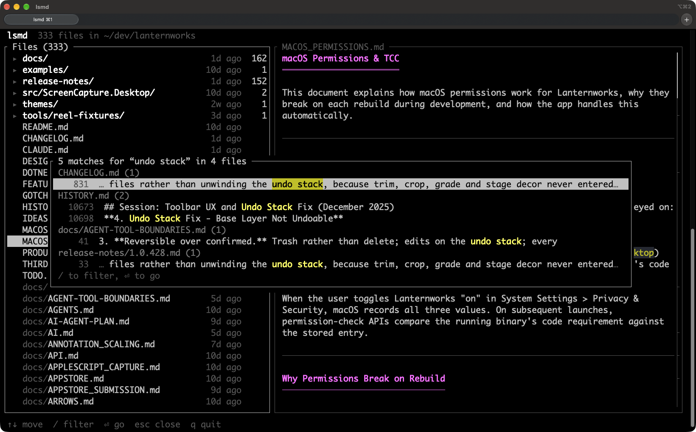
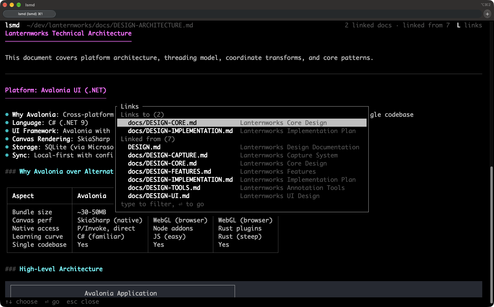
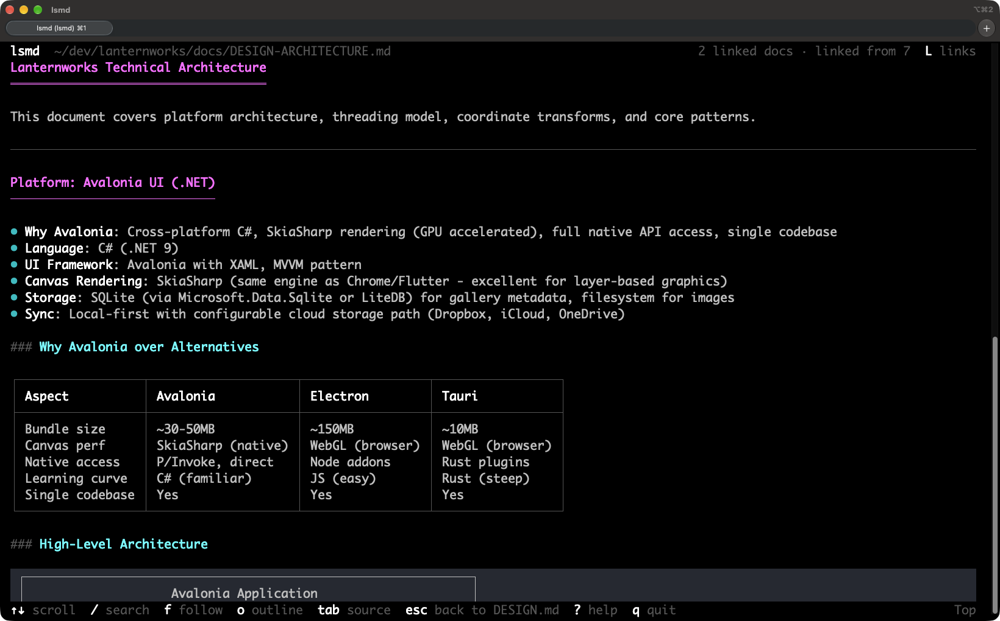
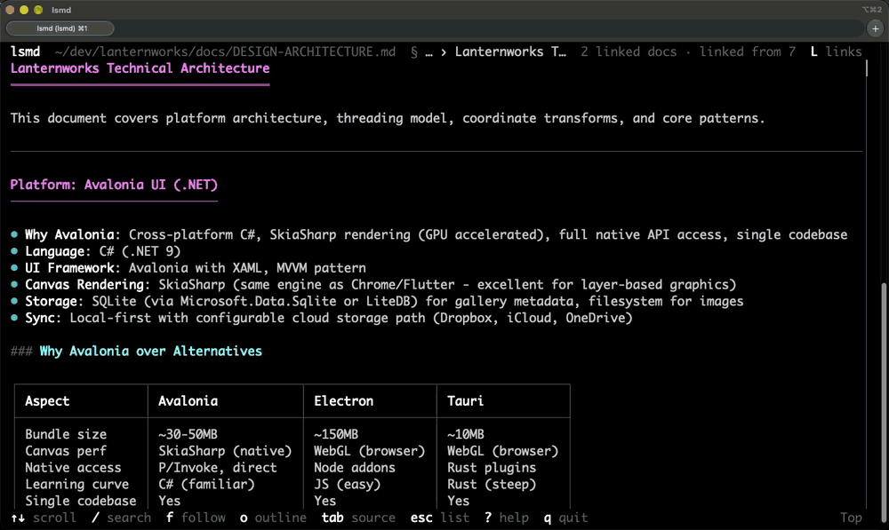
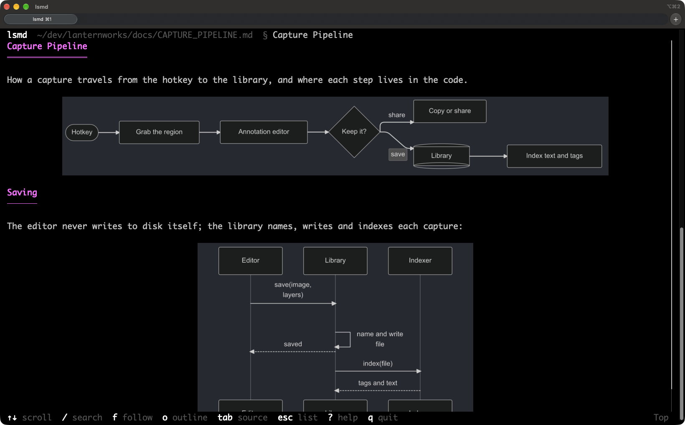

# lsmd

**A terminal-friendly Markdown (.md) reader built for speed and easy navigation in large projects.**

`lsmd` shows every Markdown file in your project on one screen, so you can browse and read them quickly. It knows which documents link to each other, in both directions, so you can jump to related documents instantly. It searches the document you're reading as you type, and every file in the project in a moment. It makes it easy to find your way around everything your team and your AI agents write.



That's `lsmd` in a project with 333 Markdown files. The folders come first, each with how many files are in it, then every file, with how long ago it changed; holding `↓` renders each one beside the list as fast as your keyboard repeats. A folder shows what's in it, `→` goes in and `←` comes back out. `/design-arch` narrows the list to one file and `Enter` opens it. `o` brings up its outline, where the text follows each heading as you move through them. Then `/golden` searches the document, and `n` goes to the next match.

## Why

Documentation piles up. A project that's been worked on for a while, especially with AI agents writing plans and design notes, ends up with hundreds of Markdown files that refer to each other. Reading them one at a time in an editor or a pager loses the thread. `lsmd` is built for following it.

**Search every file.** `/` narrows the list by name as you type, and a moment after you stop, the files with it in their text follow, most matches first; the preview shows each one's first match. `s` lists every matching line in every file instead, grouped by file. Either way, opening a file lands on the match, highlighted, with `n` and `N` for the next ones.



**See how documents connect.** The header shows how the document on screen is connected: `2 linked docs · linked from 7`. `L` lists both directions, with each document's title. "Linked from" answers the question you usually have in a pile of docs: what else refers to this? Links to files that don't exist are struck through.



**Chase links, then come back.** Follow a link from the links panel, by clicking it, or with `f`, which puts a letter on every link on screen for you to type. Keep going as deep as you like. `Esc` (or `←`) goes back one document at a time, each scrolled to where you were, and the footer says where it'll take you. When there's nowhere left to go back to, it takes you to the file list.



**Find your place in a long document.** The header always shows which section you're in (`§ Install › On Windows`), and a scrollbar shows where you are; click or drag it to jump. `/` searches the document, `]` and `[` jump between headings, `o` opens the outline, where the text follows along as you move through the headings (`/` filters them), and `O` keeps the outline open beside the text, highlighting the section you're reading.



**Stays current.** Documents reload as they're edited, keeping your place, so `lsmd` works beside your editor, or beside an agent that's writing. `e` opens your editor at the line you're reading.

**Diagrams and pictures.** Mermaid diagrams are drawn in the theme's colors, and images in the project are shown where they are: PNG, JPEG, GIF, WebP or SVG, as Markdown or as the `` tags READMEs open their logos with. That works in terminals that can show pictures: iTerm2, Kitty, WezTerm, Ghostty and those with Sixel. Elsewhere, and in tmux, diagrams stay as code and images as their descriptions. Images from the web aren't fetched, so reading a document never reaches out to the internet.



It reads well, too. Text uses the full width of the terminal, and tables, code (long lines wrap, marked `↪`, so there's no scrolling sideways), task lists, footnotes, GitHub's `> [!NOTE]` alerts and the HTML that READMEs open with all render. `Tab` shows the Markdown source beside the rendered text, scrolled together, for when you're writing rather than reading, and `#` numbers the text with the lines it comes from.

`lsmd` runs on macOS, Linux and Windows. When its output isn't a terminal, `lsmd FILE` prints the rendered document and `lsmd` lists the files, for scripts.

## Install

lsmd runs on macOS, Linux (x86_64 and 64-bit ARM) and Windows 10 or later (x86_64).

With [Homebrew](https://brew.sh), on macOS and Linux:

```sh
brew install sanford/tap/lsmd
```

On Windows, download `lsmd-windows-x64.zip` from the [latest release](https://github.com/sanford/lsmd/releases/latest), unzip it, and put `lsmd.exe` in a folder on your `PATH`. It needs nothing else installed. Or, from PowerShell:

```powershell
$dir = "$env:LOCALAPPDATA\Programs\lsmd"
Invoke-WebRequest https://github.com/sanford/lsmd/releases/latest/download/lsmd-windows-x64.zip -OutFile "$env:TEMP\lsmd.zip"
Expand-Archive "$env:TEMP\lsmd.zip" $dir -Force
[Environment]::SetEnvironmentVariable('Path', "$([Environment]::GetEnvironmentVariable('Path', 'User'));$dir", 'User')
```

Then open a new terminal and run `lsmd`.

With Cargo, if you have a [Rust toolchain](https://rustup.rs):

```sh
cargo install --git https://github.com/sanford/lsmd
```

Or build from source:

```sh
git clone https://github.com/sanford/lsmd
cd lsmd
cargo build --release
./target/release/lsmd
```

While hacking on it, `./run.sh [ARGS]` (or `.\run.ps1 [ARGS]` on Windows) builds, installs to `~/.local/bin`, and runs in one step.

## Usage

```sh
lsmd                 # browse the Markdown files under this directory
lsmd docs/           # ...under docs/
lsmd README.md       # read one file (Esc for the list of the others)
lsmd -s README.md    # ...with its source alongside
cat notes.md | lsmd  # read standard input
lsmd README.md | less -R   # not a terminal: print it rendered
lsmd | wc -l         # not a terminal: list the files
```

The list starts with the folders, each showing when its newest file changed and how many files are in it, and the files at the top level; below a line, every file in the folders follows, with its path. A selected folder shows what's in it beside the list. `→` goes into a folder, listing only what's in it, with `/` and `s` narrowed to it too, and `←` comes back up, to the folder you left; so does `..` at the top of the list. `Space` opens a folder in place, to look inside without going in. Filtering shows the best-matching folders above the files whose names match, and below them, the files with the filter in their text.

`.gitignore`d and hidden files are left out; `-a` includes them, and `.` in the list shows or hides just the hidden ones. `-w 100` caps the text width. `-p` prints without colors, as does setting `NO_COLOR`.

### Keys

In the file list:

| Key | |
|---|---|
| `↑` `↓` `j` `k` | Move; with `Shift` (`⇧↑` `⇧↓` `K` `J`), a page at a time |
| `Enter` `→` `l` | Read the selected file, or go into the selected folder |
| `←` `h` `Backspace` | Up a folder (or choose `..` at the top of the list) |
| `/` | Filter the list by name (fuzzy); files with it in their text follow, most matches first |
| `s` | Search the text of every file in the list |
| `m` | Sort by name or by date |
| `.` | Show or hide hidden files |
| `Space` | On a folder: look inside without going in, or close it |
| `Space` `b` | Page through the preview |
| `q` `Esc` | Quit (`Esc` first clears the filter, then goes up a folder) |

Reading:

| Key | |
|---|---|
| `↑` `↓` `j` `k` | Scroll two lines (`scroll` in the settings); with `Shift` (`⇧↑` `⇧↓` `K` `J`), a page |
| `Space` `b`, `d` `u`, `g` `G` | Page, half page; top, bottom |
| `/` `n` `N` | Search this document; next and previous match |
| `]` `[` | Next and previous heading |
| `o` | Outline: `↑` `↓` `j` `k` go through the headings with the text following as you move, `/` filters them, `Enter` reads from there, `Esc` goes back to where you were |
| `O` | The same outline, kept open beside the document, highlighting the section you're reading. `Enter` gives the keyboard back to the text, `O` gives it to the outline again, and `O` from the outline closes it |
| `f` | Follow a link: type the letters drawn on it |
| `L` | Links: what this links to, and what links here (in this and the other popups: `↑` `↓` `j` `k` move, `/` filters, `Enter` goes) |
| `Esc` `Backspace` `←` `h` | Back to where you were before following a link; then the list |
| `q` | Quit |

Anywhere:

| Key | |
|---|---|
| `Tab` | Show or hide the source beside the rendered text |
| `#` | Show or hide line numbers: the source line each paragraph, list item, table row and line of code starts on |
| `Ctrl-W` `Shift-Tab` | Scroll the source side or the rendered side |
| `<` `>` | Move the divider |
| `e` | Edit the file in `$VISUAL` or `$EDITOR`, at the line you're reading |
| `y` `Y` | Copy the code block on screen, or the file's path |
| `\` | Keep the file list on screen while reading |
| `T` | Pick a color theme |
| `?` | All of the above |

Emacs keys work everywhere too: `Ctrl-N` `Ctrl-P` move down and up, `Ctrl-V` `Alt-V` a page, `Alt-<` `Alt->` to the ends, and `Ctrl-G` is `Esc`. In a document, `Ctrl-S` and `Ctrl-R` search forward and backward; while you type, they go to the next and previous match, and `Ctrl-S` on an empty search repeats the last one.

The mouse works too: the wheel scrolls what's under it, the scrollbar and the outline jump where you click, clicking a file selects it and clicking again opens it, and clicking a link follows it. `--no-mouse` leaves the mouse to the terminal, so you can select text without holding a modifier key.

### Links between documents

The header shows how the document on screen is connected, like `3 linked docs · linked from 2`, and `L` lists those documents with their titles, along with links to sections, other files and the web. Following a link to another Markdown file opens it in `lsmd`. Web and email links open in your browser or mail app after you confirm, with the site named in the question; images, PDFs and other documents open in their default app the same way. `lsmd` won't open anything else a link points to, such as a program, a script or another app's link, since the documents you read may be someone else's.

"Linked from" comes from an index of the links between all the Markdown files under the directory you're browsing. It's built in the background when `lsmd` starts, kept up to date as files change, and saved in `~/.lsmd/index/` so the next start only re-reads files that changed.

### Copying over SSH

`y` and `Y` use the system clipboard (`pbcopy`, `wl-copy`, `xclip`, `xsel` or `clip`). Over SSH they ask your terminal to do the copying instead, with an OSC 52 escape sequence, so the text lands on your own machine. Most modern terminals support this; in tmux, it needs `set -g set-clipboard on`. macOS Terminal doesn't support it.

### Colors

`T` picks a color theme: the screen changes as you move through the list, `Enter` keeps the one you're on and saves it in `~/.lsmd/config.toml`, and `Esc` goes back. The themes are [Omarchy](https://omarchy.org)'s: `tokyo-night`, `catppuccin`, `catppuccin-latte`, `gruvbox`, `nord`, `rose-pine`, `kanagawa`, `everforest` and more. A theme colors everything, background included, and your terminal goes back to its own colors when `lsmd` exits. `--theme` picks one too.

Without one (`auto`, `dark` or `light`), text uses your terminal's own colors, and code is colored by a built-in dark or light theme; `auto` picks whichever suits the terminal's background.

On Omarchy, the desktop's theme wins: code takes its colors from it, and changes when you switch themes, even in a document you already have open. `theme = "dark"` or `"light"` turns this off.

## Configuration

Defaults for the options can go in `~/.lsmd/config.toml`. Everything is optional, and flags win over it:

```toml
theme = "dark"          # auto, dark, light or a theme like "tokyo-night"
width = 100             # wrap text at 100 columns (0: the terminal's width)
source = true           # start with the source shown beside the text
source-side = "left"    # left or right
mouse = false           # leave the mouse to the terminal
all = true              # list hidden and .gitignored files too
sort = "date"           # name or date
outline = true          # show the outline beside documents
images = false          # show diagrams as code and images as text
scroll = 1              # lines j and k scroll (default 2)
```

## License

Copyright (C) 2026 Sanford Lincoln

`lsmd` is free software: you can redistribute it and/or modify it under the terms of the GNU General Public License as published by the Free Software Foundation, either version 3 of the License, or (at your option) any later version. See [LICENSE](LICENSE).

The color themes in [`themes/`](themes/) are [Omarchy](https://omarchy.org)'s, copyright (c) David Heinemeier Hansson, and used under the MIT License. See [themes/LICENSE](themes/LICENSE).
