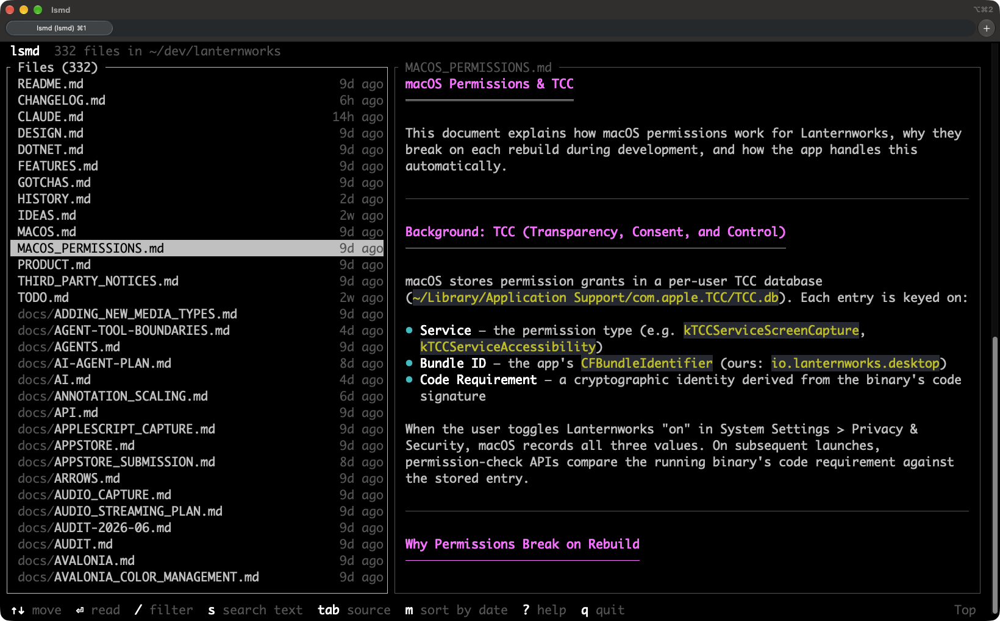

# lsmd

**A terminal-friendly Markdown (.md) reader built for speed and easy navigation in large projects.**

`lsmd` shows every Markdown file in your project on one screen, so you can browse and read them quickly. It knows which documents link to each other, in both directions, so you can jump to related documents instantly. It searches the document you're reading as you type, and every file in the project in a moment. It makes it easy to find your way around everything your team and your AI agents write.



That's what you see when you run `lsmd` in a project: every Markdown file, with how long ago it changed, and the selected one rendered beside the list. `↑` `↓` move through them, `Enter` opens one full screen.

## Why

Documentation piles up. A project that's been worked on for a while, especially with AI agents writing plans and design notes, ends up with hundreds of Markdown files that refer to each other. Reading them one at a time in an editor or a pager loses the thread. `lsmd` is built for following it.

**Search every file.** `/` narrows the list by name as you type, and `s` searches the text of every document in it. The matches come back grouped by file; opening one lands on the match, highlighted, with `n` and `N` for the next ones.


**See how documents connect.** The header shows how the document on screen is connected: `2 linked docs · linked from 7`. `L` lists both directions, with each document's title. "Linked from" answers the question you usually have in a pile of docs: what else refers to this? Links to files that don't exist are struck through.


**Chase links, then come back.** Follow a link from the links panel, by clicking it, or with `f`, which puts a letter on every link on screen for you to type. Keep going as deep as you like. `Esc` goes back one document at a time, each scrolled to where you were, and the footer says where it'll take you. When there's nowhere left to go back to, it takes you to the file list.


**Find your place in a long document.** `/` searches it, `]` and `[` jump between headings, and `o` opens an outline you can filter.

**Stays current.** Documents reload as they're edited, keeping your place, so `lsmd` works beside your editor, or beside an agent that's writing. `e` opens your editor at the line you're reading.

It reads well, too. Text uses the full width of the terminal, and tables, code, task lists, footnotes, GitHub's `> [!NOTE]` alerts and the HTML that READMEs open with all render. `Tab` shows the Markdown source beside the rendered text, scrolled together, for when you're writing rather than reading.

`lsmd` runs on macOS, Linux and Windows. When its output isn't a terminal, `lsmd FILE` prints the rendered document and `lsmd` lists the files, for scripts.

## Install

lsmd runs on macOS, Linux (x86_64 and 64-bit ARM) and Windows 10 or later (x86_64).

With [Homebrew](https://brew.sh), on macOS and Linux:

```sh
brew install sanford/tap/lsmd
```

On Windows, download `lsmd-windows-x64.zip` from the [latest release](https://github.com/sanford/lsmd/releases/latest), unzip it, and put `lsmd.exe` in a folder on your `PATH`. It needs nothing else installed. Or, from PowerShell:

```powershell
$dir = "$env:LOCALAPPDATA\Programs\lsmd"
Invoke-WebRequest https://github.com/sanford/lsmd/releases/latest/download/lsmd-windows-x64.zip -OutFile "$env:TEMP\lsmd.zip"
Expand-Archive "$env:TEMP\lsmd.zip" $dir -Force
[Environment]::SetEnvironmentVariable('Path', "$([Environment]::GetEnvironmentVariable('Path', 'User'));$dir", 'User')
```

Then open a new terminal and run `lsmd`.

With Cargo, if you have a [Rust toolchain](https://rustup.rs):

```sh
cargo install --git https://github.com/sanford/lsmd
```

Or build from source:

```sh
git clone https://github.com/sanford/lsmd
cd lsmd
cargo build --release
./target/release/lsmd
```

While hacking on it, `./run.sh [ARGS]` (or `.\run.ps1 [ARGS]` on Windows) builds, installs to `~/.local/bin`, and runs in one step.

## Usage

```sh
lsmd                 # browse the Markdown files under this directory
lsmd docs/           # ...under docs/
lsmd README.md       # read one file (Esc for the list of the others)
lsmd -s README.md    # ...with its source alongside
cat notes.md | lsmd  # read standard input
lsmd README.md | less -R   # not a terminal: print it rendered
lsmd | wc -l         # not a terminal: list the files
```

`.gitignore`d and hidden files are left out; `-a` includes them. `-w 100` caps the text width. `-p` prints without colors, as does setting `NO_COLOR`.

### Keys

In the file list:

| Key | |
|---|---|
| `↑` `↓` `j` `k` | Move |
| `Enter` `→` `l` | Read the selected file |
| `/` | Filter the list by name (fuzzy) |
| `s` | Search the text of every file in the list |
| `m` | Sort by name or by date |
| `Space` `b` | Page through the preview |
| `q` `Esc` | Quit |

Reading:

| Key | |
|---|---|
| `↑` `↓` `j` `k`, `Space` `b`, `d` `u`, `g` `G` | Scroll by line, page, half page; top, bottom |
| `←` `→` `h` `l` | Scroll long code lines sideways (`0` back to the start) |
| `/` `n` `N` | Search this document; next and previous match |
| `]` `[` | Next and previous heading |
| `o` | Outline: jump to a heading |
| `f` | Follow a link: type the letters drawn on it |
| `L` | Links: what this links to, and what links here |
| `Esc` `Backspace` | Back to where you were before following a link; then the list |
| `q` | Quit |

Anywhere:

| Key | |
|---|---|
| `Tab` | Show or hide the source beside the rendered text |
| `Ctrl-W` `Shift-Tab` | Scroll the source side or the rendered side |
| `<` `>` | Move the divider |
| `e` | Edit the file in `$VISUAL` or `$EDITOR`, at the line you're reading |
| `y` `Y` | Copy the code block on screen, or the file's path |
| `\` | Keep the file list on screen while reading |
| `?` | All of the above |

The mouse works too: the wheel scrolls what's under it, clicking a file selects it and clicking again opens it, and clicking a link follows it. `--no-mouse` leaves the mouse to the terminal, so you can select text without holding a modifier key.

### Links between documents

The header shows how the document on screen is connected, like `3 linked docs · linked from 2`, and `L` lists those documents with their titles, along with links to sections, other files and the web. Following a link to another Markdown file opens it in `lsmd`. Web and email links open in your browser or mail app after you confirm, with the site named in the question; images, PDFs and other documents open in their default app the same way. `lsmd` won't open anything else a link points to, such as a program, a script or another app's link, since the documents you read may be someone else's.

"Linked from" comes from an index of the links between all the Markdown files under the directory you're browsing. It's built in the background when `lsmd` starts, kept up to date as files change, and saved in `~/.lsmd/index/` so the next start only re-reads files that changed.

### Copying over SSH

`y` and `Y` use the system clipboard (`pbcopy`, `wl-copy`, `xclip`, `xsel` or `clip`). Over SSH they ask your terminal to do the copying instead, with an OSC 52 escape sequence, so the text lands on your own machine. Most modern terminals support this; in tmux, it needs `set -g set-clipboard on`. macOS Terminal doesn't support it.

## Configuration

Defaults for the options can go in `~/.lsmd/config.toml`. Everything is optional, and flags win over it:

```toml
theme = "dark"          # auto, dark or light (auto asks the terminal)
width = 100             # wrap text at 100 columns (0: the terminal's width)
source = true           # start with the source shown beside the text
source-side = "left"    # left or right
mouse = false           # leave the mouse to the terminal
all = true              # list hidden and .gitignored files too
sort = "date"           # name or date
```

## License

Copyright (C) 2026 Sanford Lincoln

`lsmd` is free software: you can redistribute it and/or modify it under the terms of the GNU General Public License as published by the Free Software Foundation, either version 3 of the License, or (at your option) any later version. See [LICENSE](LICENSE).
